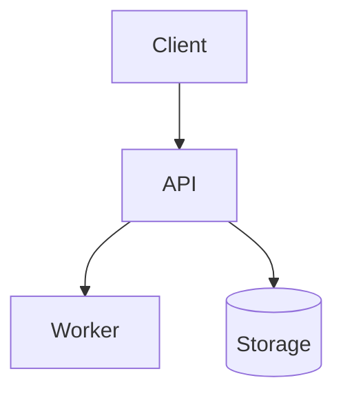

# <System name>

<!-- One-paragraph pitch — what it is, why it was made, why it is needed. -->

## Goal

<!-- What the system does — a short paragraph plus a few bullets. -->

## Non-Goal

- <!-- What this system deliberately does not do. -->

## Requirements

**Functional** — <!-- what the system must do; observable behaviors. -->

**Non-functional** — <!-- the qualities and constraints it must hold:
performance, isolation, cost, operability. -->

## Background

<!-- The problem context that motivated this — objective facts only. -->

## Repositories

<!-- Drop this section for a single-repo project. -->

| Repository | Scope |
|---|---|
| <owner/repo> | <what lives there> |

## High-level architecture



## Components

| Component | Responsibility | Doc |
|---|---|---|
| <service/component> | <responsibility and purpose> | [architecture/<service>/](architecture/) |

## Component internals

<!-- Internal specs and processing flows at the invariant level; defer to
per-service docs for anything longer than a paragraph. Service docs live
in `architecture/<service>/` subtrees — link to them. -->

## Security

- <!-- Trust boundaries, authn/z, data classification. -->

## Decisions and alternatives

<!-- The system-level choices that shaped everything below — each with the
alternative it beat and why. One or two lines per decision; link the
ADR or design doc that settled it for the full analysis. -->

- **<decision>** over <rejected alternative> — <why, tied to the goals
  and constraints above> ([ADR-NNNN](adr/NNNN-<slug>.md))

## Risks and known issues

- <!-- Operational risks, failure modes, and known holes/limitations.
  Actionable items get a file in [issues/](issues/). -->

## Testing

```bash
<commands that run the test suite — and what each covers>
```

## Operations

<!-- How to deploy, observe, and steer the system day to day — environments,
dashboards, runbook pointers. -->

## References

- <External links — dependencies, formats, prior art.>

## In this directory

| Path | Contents |
|---|---|
| [architecture/](architecture/) | Living docs — one subtree per service |
| [design-docs/](design-docs/) | Change proposals; `archived/` holds finished ones |
| [adr/](adr/) | Decision records |
| [issues/](issues/) | Known issues; `archived/` holds closed ones |

## Notes

<!-- Doc conventions, caveats, anything else. -->
