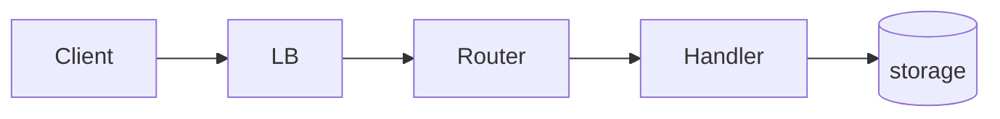

# <Service> API

<!-- One line — the surface and its audiences. -->

## Context

<!-- Objective facts that constrain the surface — who the callers are, what
they can and cannot do (legacy SDKs, firewall rules, retry habits),
volume, upstream systems it must fit. Facts only; every requirement and
convention below should trace back to a fact here. -->

## Goals and non-goals

### Goals

- <!-- caller-observable outcomes the surface must deliver -->

### Non-goals

- <!-- reasonable-seeming scope deliberately excluded — e.g. a query
  language, bulk import, a second protocol -->

## Requirements

**Functional**

- <!-- what callers can do — each requirement observable from the outside:
  endpoints exist, writes are idempotent, errors carry a stable code -->

**Non-functional**

- <!-- the qualities and constraints — sustained/burst volume, latency and
  freshness SLOs, availability, operability limits -->

## Architecture

<!-- Ingress → router → middleware → handlers → datastores and queues.
Mermaid where a diagram beats prose; note what the service deliberately
does *not* do in-line. -->

## Conventions

<!-- Surface-wide choices — authn/authz model, versioning rule, error
shape, pagination, idempotency. Each convention is a decision: state it
with the constraint or rejected alternative that produced it, not just
the rule. A convention that outgrows a bullet gets its own policy doc
(`authentication.md`, `error-handling.md`) — link it here. -->

## Contract inventory

| Surface | Base path | Callers | Doc |
|---|---|---|---|
| <resource> | `<path>` | <scopes/audiences> | [surface.md](surface.md) |

<!-- One doc per contract surface. Keep the doc at contract level — link the
schema source of truth (OpenAPI/protobuf/migrations) instead of
inlining payloads or field lists; inlined schemas rot. -->

## Data model

<!-- High-level entity/table shape — the stores and projections the surface
reads and writes, not column-level schemas (those live with the code). -->

## Dependencies

| Depends on | Why |
|---|---|
| <datastore / queue / service> | <what it provides> |

## Decisions and alternatives

<!-- Surface-level choices that shaped every resource — each with the
alternative it beat and why; link the settling ADR or design doc. -->

- **<decision>** over <rejected alternative> — <why>
  ([ADR-NNNN](../../adr/NNNN-<slug>.md))

## Risks and mitigations

- <open risk> — <mitigation>; actionable items get a file in
  [../../issues/](../../issues/).
