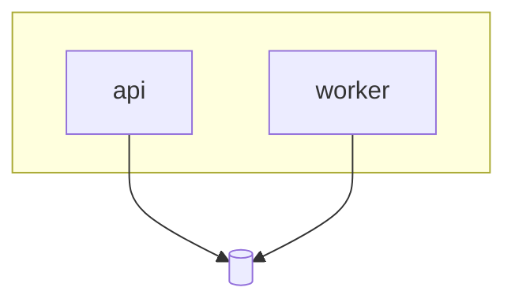

# Infrastructure

## Context

<!-- Objective facts constraining the platform — services and their load,
SLOs, cost budget, team size/on-call reality. These facts justify the
topology and tooling choices below. -->

## Goal

<!-- What the platform layer provides — one paragraph on environments,
deployment, and the operational contract the services rely on. -->

## Topology

## Service map

Which infra components serve which services — the first place to look
when an infra change lands.

| Service | Runs on | Scales by | Infra docs |
|---|---|---|---|
| <api> | <runtime> | <signal> | [mechanism.md](mechanism.md) |

## Observability

<!-- Signals and where they live — metrics/logs/traces, dashboards, alert
routes. The operational entry point during an incident. -->

## Scaling model

<!-- What scales on what signal, ceilings, and known limits. Per-mechanism
detail lives in the docs below. -->

## In this directory

| Doc | Mechanism | Services affected |
|---|---|---|
| [mechanism.md](mechanism.md) | <what it does> | <services> |
