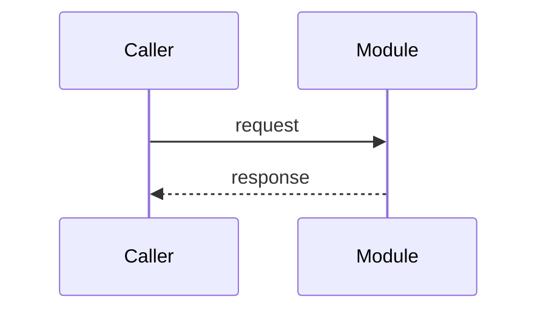

# <Module name>

## Context

<Objective facts that constrain this module — who calls it, load and
latency it must hold, upstream/downstream systems it must fit.
Facts only, no design yet.>

## Goal

<The module's responsibility and purpose — one paragraph. What it owns;
what it deliberately does not.>

## Boundaries

<The public surface other modules may use — package facade, API, events —
and what stays internal.>

## Design

<Internal spec and processing flow at the invariant level — data
structures, main flows, the states a unit of work passes through.
Mermaid where a diagram beats prose.>

## Failure modes

<What each dependency failure looks like — what the module drops,
retries, or degrades to, and what callers observe.>

## Dependencies

| Depends on | Why |
|---|---|
| <module/repo/service> | <what it provides> |

## Decisions and alternatives

<Each significant choice with the alternative it beat and why — one or
two lines each; link the ADR or plan that settled it for the full
analysis.>

- **<decision>** over <rejected alternative> — <why> (settled by
  [ADR-NNNN](../adr/NNNN-<slug>.md) / the plan that shipped it)

## Security

<Trust boundary and enforcement mechanism, if any.>

## Known issues

- <Limits and holes specific to this module.>

## Testing

<Commands and what they cover.>

## Notes

<Caveats that don't fit elsewhere.>
