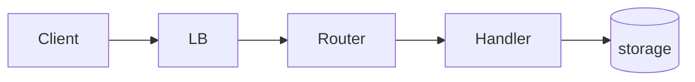

# <Service> API — basic design

How the surface is put together. What it must satisfy lives
in [requirements.md](requirements.md); per-resource internals live in
[detailed.md](detailed.md).

## System architecture

<Ingress → router → middleware → handlers → datastores and queues.
Mermaid where a diagram beats prose; note what the module deliberately
does *not* do in-line.>

## Conventions

<Surface-wide choices — authn/authz model, versioning rule, error
shape, pagination, idempotency. Each convention is a decision: state it
with the constraint or rejected alternative that produced it, not just
the rule.>

## Contract inventory

| Surface | Base path | Callers | Detail |
|---|---|---|---|
| <resource> | `<path>` | <scopes/audiences> | [detailed.md](detailed.md) |

## Data model

<High-level entity/table shape — the stores and projections the surface
reads and writes, not column-level schemas (those live with the code).>

## Dependencies

| Depends on | Why |
|---|---|
| <datastore / queue / service> | <what it provides> |

## Decisions and alternatives

<Surface-level choices that shaped every resource — each with the
alternative it beat and why; link the settling ADR or plan.>

- **<decision>** over <rejected alternative> — <why>
  ([ADR-NNNN](../adr/NNNN-<slug>.md))

## Risks and mitigations

- <open risk> — <mitigation>; actionable items get a row in
  [../issues/](../issues/).
