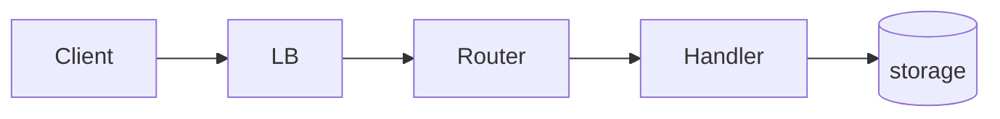

# <Service> API design

## Overview

<What this API surface is for — who calls it and what it lets them do.
One paragraph.>

## Background and motivation

<Objective facts constraining the whole surface — who the callers are,
what they can and cannot do (legacy SDKs, firewall rules, retry
habits), volume and SLOs. These facts justify the conventions below.>

## Goals and non-goals

### Goals

- <caller-observable outcomes the surface must deliver>

### Non-goals

- <reasonable-seeming scope deliberately excluded — e.g. a query
  language, bulk import, a second protocol>

## System architecture

<How the module is put together and where it sits — ingress → router →
middleware → handlers → datastores and queues. Mermaid where a diagram
beats prose.>

## Conventions

<Surface-wide choices — authn/authz model, versioning rule, error
shape, pagination, idempotency. Each convention is a decision: state it
with the constraint or rejected alternative that produced it ("cursor
pagination — offset is unstable under append-heavy writes"), not just
the rule.>

## In this directory

| Doc | Contract surface |
|---|---|
| [<resource>](resource.md) | <resource lifecycle — one line> |

One doc per contract surface — a resource's CRUD family or one endpoint
group. Schemas live in the OpenAPI spec or handlers, not here — these
docs carry the invariants and decisions a caller relies on.

## Dependencies

| Depends on | Why |
|---|---|
| <datastore / queue / service> | <what it provides> |

## Risks and mitigations

- <open risk> — <mitigation>; actionable items get a row in
  [../../issues/](../../issues/).

## Testing

<The suite a change to this surface must pass — contract tests,
ingestion cases.>
