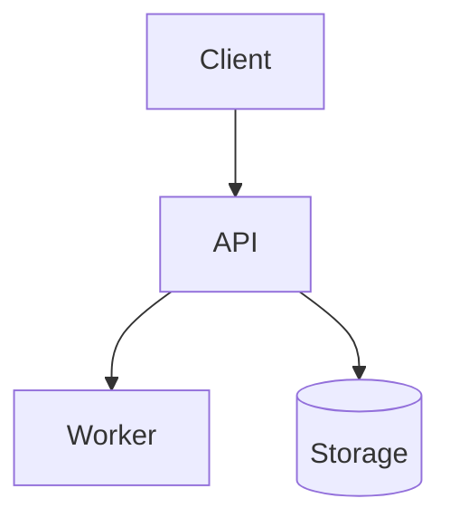

# <System name>

<One-paragraph pitch — what it is, why it was made, why it is needed.>

## Goal

<What the system does — a short paragraph plus a few bullets.>

## Non-Goal

- <What this system deliberately does not do.>

## Requirements

**Functional** — <what the system must do; observable behaviors.>

**Non-functional** — <the qualities and constraints it must hold:
performance, isolation, cost, operability.>

## Background

<The problem context that motivated this — objective facts only.>

## Repositories

| Repository | Scope |
|---|---|
| <owner/repo> | <what lives there> |

## High-level architecture



## Components

| Component | Responsibility | Doc |
|---|---|---|
| <module/service> | <responsibility and purpose> | [<module>/design/](../<module>/design/) |

## Component internals

<Internal specs and processing flows at the invariant level; defer to
per-module docs for anything longer than a paragraph. Module docs live
in `<module>/design/` subtrees — link to them.>

## Security

- <Trust boundaries, authn/z, data classification.>

## Risks and known issues

- <Operational risks, failure modes, and known holes/limitations.
  Actionable items get a row in [../issues/](../issues/).>

## Testing

```bash
<commands that run the test suite — and what each covers>
```

## Operations

<How to deploy, observe, and steer the system day to day — environments,
dashboards, runbook pointers.>

## References

- <External links — dependencies, formats, prior art.>

## In this directory

This README is the only doc here — module docs live in each
`<module>/design/` subtree.

## Notes

<Doc conventions, caveats, anything else.>
