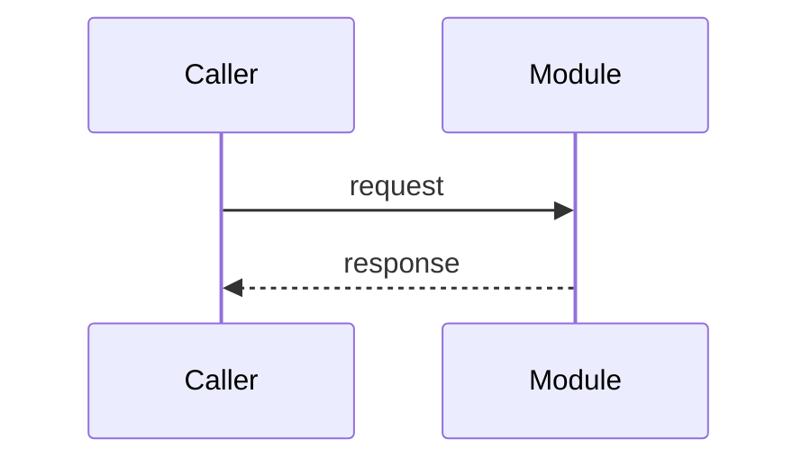

# <Module name>

## Goal

<The module's responsibility and purpose — one paragraph. What it owns;
what it deliberately does not.>

## Boundaries

<The public surface other modules may use — package facade, API, events —
and what stays internal.>

## Design

<Internal spec and processing flow at the invariant level — data
structures, main flows. Mermaid where a diagram beats prose.>

## Dependencies

| Depends on | Why |
|---|---|
| <module/repo/service> | <what it provides> |

## Key decisions

- <Decision> — see [ADR-NNNN](../adr/NNNN-<slug>.md) or the plan doc that
  settled it

## Security

<Trust boundary and enforcement mechanism, if any.>

## Known issues

- <Limits and holes specific to this module.>

## Testing

<Commands and what they cover.>

## Notes

<Caveats that don't fit elsewhere.>
