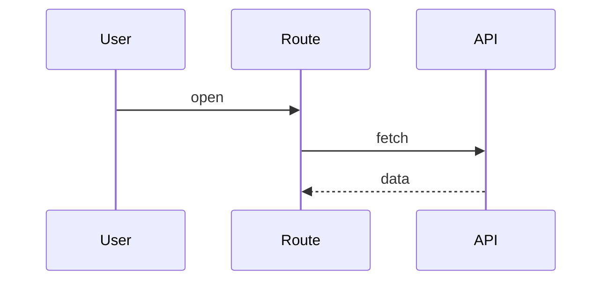

# <Route name>

Route: `<path>` — permission: <role/scope>

## Context

<Objective facts that constrain this screen — who uses it and how often,
what decision they're trying to make, latency/freshness the task
demands, device/browser constraints. Facts only.>

## Goal

<What the user accomplishes on this screen.>

## Contract

- **Data in** — <queries/endpoints the route depends on>
- **States** — loading / empty / error / ready: <what each shows>
- **Actions** — <what the user can trigger; which API calls>

## Interactions

## Degraded behavior

<What the user sees when a dependency fails or the connection drops —
stale-data policy, retry/backoff, what stays usable offline. A design
choice, not a bug list.>

## Decisions and alternatives

<Each significant choice with the alternative it beat and why.>

- **<decision>** over <rejected alternative> — <why> (settled by
  [ADR-NNNN](../adr/NNNN-<slug>.md) / the plan that shipped it)

## Security

<What a user without permission sees; what the route must never render.>

## Known issues

- <Limits and holes specific to this route.>
