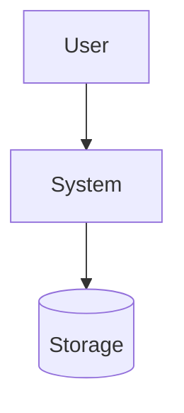

# <Project name>

<One-paragraph pitch — what it is, why it was made, why it is needed.>

## Goal

<What the project does — a short paragraph plus a few bullets.>

## Non-Goal

- <What this project deliberately does not do.>

## Requirements

**Functional** — <what the system must do; observable behaviors.>

**Non-functional** — <the qualities and constraints it must hold:
performance, isolation, cost, operability.>

## Background

<The problem context that motivated this — why it exists.>

## High-level architecture



## Components

| Component | Responsibility | Doc |
|---|---|---|
| <name> | <responsibility and purpose> | [<doc>.md](<doc>.md) |

## Component internals

<Internal specs and processing flows — data structures, algorithms. Write
only what code cannot tell you: invariants and why an approach was chosen.
When a part needs more than a paragraph, split it into
[<component>.md](component.md) — per functional unit or physical
component (module, screen), whichever explains the design better.>

## Security

- <Trust boundaries, authn/z, confinement — whatever applies.>

## Risks and known issues

- <Operational risks, failure modes, and known holes/limitations.
  Actionable items get a row in [../issues/](../issues/).>

## Testing

```bash
<commands that run the test suite — and what each covers>
```

## Operations

<How to run, observe, and steer the system day to day.>

## References

- <External links — dependencies, formats, prior art.>

## In this directory

| Doc | Contents |
|---|---|
| [<doc>.md](<doc>.md) | <what it covers> |

## Notes

<Doc conventions, caveats, anything else.>
