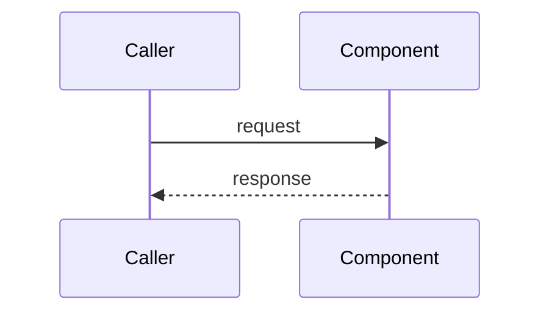

# <Component name>

## Goal

<The component's responsibility and purpose — one paragraph.>

## Design

<Internal spec and processing flow at the invariant level — data
structures, algorithms, lifecycle. Use a mermaid sequence diagram for
interactions, a flowchart for branching logic — wherever a diagram beats
prose.>

## Failure modes

<What each dependency failure looks like — what the component drops,
retries, or degrades to.>

## Decisions and alternatives

<Each significant choice with the alternative it beat and why — one or
two lines each; link the ADR that settled it. A decision with no
recorded reasoning is a decision future readers will relitigate.>

- **<decision>** over <rejected alternative> — <why> ([ADR-NNNN](../adr/NNNN-<slug>.md))

## Security

<Trust boundary and enforcement mechanism, if any.>

## Known issues

- <Limits and holes specific to this component.>

## Testing

<Commands and what they cover.>

## Notes

<Caveats that don't fit elsewhere.>
