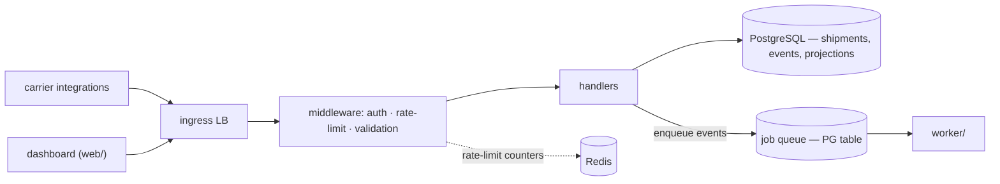

# Freightloop API

One REST surface for two audiences: carrier integrations pushing
tracking events, and the ops dashboard reading shipment state. Every
external interaction with Freightloop goes through here — no direct
database access, ever.

## Context

- ~40 carrier integrations push events; their SDKs range from modern
  HTTP clients to scheduled FTP-to-HTTP bridges that can POST but can't
  poll or hold connections open.
- Sustained ingestion is ~2k events/s with 10k/s hourly bursts (depot
  scan batches land on the hour).
- Carriers retry non-2xx aggressively — duplicate delivery is normal.
- Ops audit shipments after the fact — "what did we believe at time T"
  must be answerable.
- The dashboard reads continuously; reads and writes share one SLO
  window.

## Goals and non-goals

### Goals

- One authenticated surface for event ingestion and shipment reads.
- Idempotent writes — carrier retries must never double-record.
- Contract stability a POST-only bridge can honor for years.
- Reads stay inside SLO while ingestion bursts — no coupling.

### Non-goals

- No bulk import surface — registration is per-shipment, by design.
- No ad-hoc query language or GraphQL — filters stay enumerable.
- No outbound push to carriers — polling/SSE is the caller's side.
- No mutable status field — state is derived, always.

## Requirements

**Functional**

- Register a shipment; ingest a batch of tracking events scoped to it.
- Read shipment state, current ETA, and the full event timeline.
- Authenticate callers per carrier; scope writes to the caller's own
  shipments.
- Reject duplicate submissions by client-supplied `event_id`.
- Surface backpressure as `429` + `Retry-After`, never silent lag.

**Non-functional**

- Sustain 2k events/s ingestion; absorb 10k/s bursts up to 5 minutes.
- P95 read latency < 300 ms at ~500k active shipments.
- Ack (`202`) only after durable queueing — an acked event is never
  lost to an API crash.
- Operable by one small team — no mechanism that pages for
  self-healing conditions.

## Architecture

The API is thin by design: authenticate, validate, dedupe, persist or
enqueue, ack. Everything computable later (ETA, alerts, notifications)
is deferred to the worker so ingestion latency stays flat.

## Conventions

Each convention is a decision; the rejected alternative is what keeps
it from being arbitrary.

- **Auth** — partner keys scoped per carrier (`events:write`,
  `shipments:read`); dashboard calls carry the user's SSO session.
  Scoped keys over OAuth bearer flows because several carrier bridges
  can't run a token-refresh dance.
- **Versioning** — path prefix (`/v1/`); breaking changes ship a new
  prefix, never a flag. URL pinning is the only mechanism every
  integration — including FTP-bridge schedulers — actually honors.
- **Errors** — RFC 9457 problem shape (`type`, `title`, `status`,
  `detail`, `code`). Chosen over ad-hoc `{error: "msg"}` because
  partner SDKs key retries off a stable `code`.
- **Pagination** — cursor-based on every list endpoint; `next_cursor`
  is null at the end. Offset was rejected: event tables are
  append-heavy, so offsets drift under concurrent writes.
- **Idempotency** — writes dedupe on a client-supplied key. Carriers
  retry non-2xx aggressively, so idempotent writes are the surface's
  correctness guarantee, not a nicety.

## Contract inventory

| Surface | Base path | Callers | Doc |
|---|---|---|---|
| shipments | `/v1/shipments*` | `events:write`, `shipments:read`; dashboard | [shipments.md](shipments.md) |

## Data model

Two stores behind the surface: `events` — an append-only log keyed by
client `event_id` — and `shipments` — the folded projection the GET
endpoints serve. The API writes events and reads projections; the
worker owns the fold, so read and write paths never contend on the same
rows. Column-level schema lives in `api/openapi.yaml` and migrations.

## Dependencies

| Depends on | Why |
|---|---|
| PostgreSQL | shipments, events, folded projections, queue table |
| Job queue (PG table) | durable event handoff to the worker — see [worker/](../worker/) |
| Redis | rate-limit counters ([ADR-0002](../../adr/0002-redis-rate-limit-state.md)) — fails open |

## Decisions and alternatives

- **Thin API, deferred computation** over doing ETA/alert work in the
  request path — ingestion ack latency must stay flat under 10k/s
  bursts; anything computable later is the worker's job. The cost is
  projection lag, which the `eta.stale` flag makes honest.
- **PG table as the queue** over a dedicated broker — already deployed,
  `SKIP LOCKED` covers competitive claiming; the worker doc records
  when to revisit.
- **Rate-limit counters in Redis** over per-pod buckets and over PG
  counters — limits must hold under HPA without a write per request on
  the hot path; [ADR-0002](../../adr/0002-redis-rate-limit-state.md).

## Risks and mitigations

- A partner bursts beyond fair share → per-tenant token buckets landing
  in [the rate-limit design doc](../../design-docs/0002-api-rate-limits/);
  until it ships, tracked as [issue 0001](../../issues/0001-api-no-backpressure.md).
- Redis on the request path → fail-open on outage; HA pair in the
  doc's phase 2.
