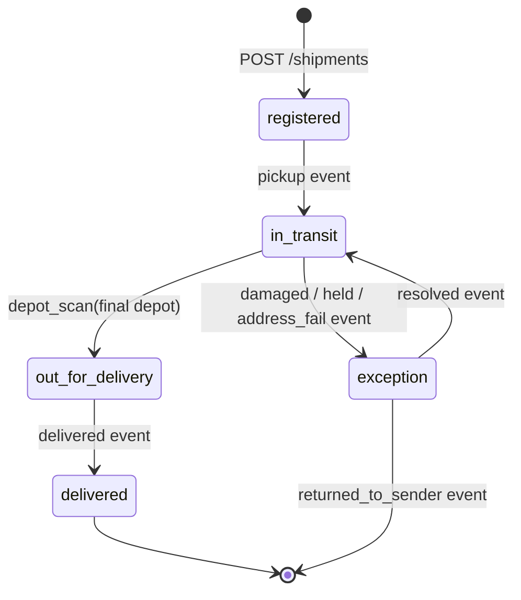
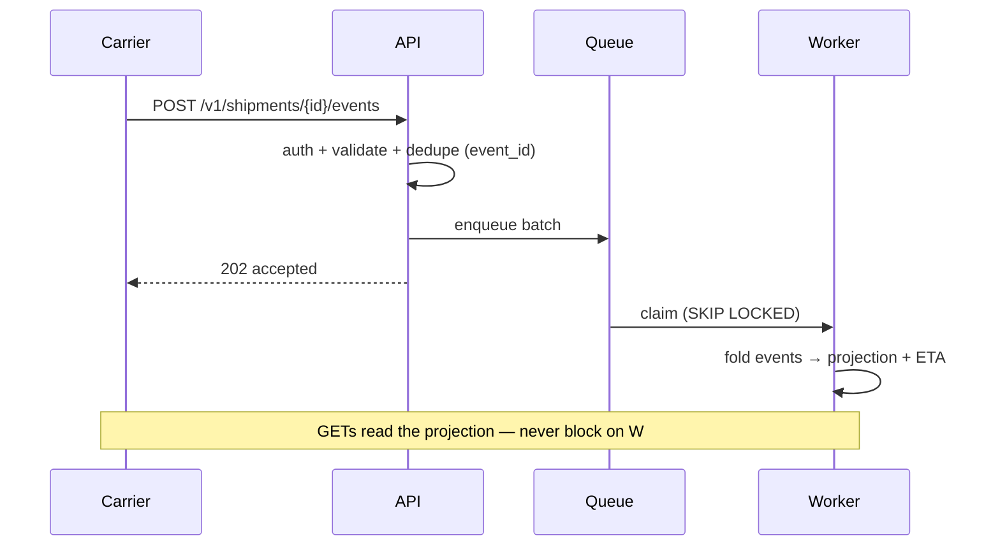

# Shipments

Surface: `/v1/shipments*` — callers: carrier keys (`events:write`,
`shipments:read`), dashboard reads. Surface-wide conventions (auth,
versioning, errors, pagination) live in [README.md](README.md).

## Contract

| Endpoint | Verb | Effect |
|---|---|---|
| `/v1/shipments` | POST | Register a shipment; returns its ID |
| `/v1/shipments` | GET | List shipments (cursor-paginated, filtered) |
| `/v1/shipments/{id}` | GET | Shipment detail incl. current ETA |
| `/v1/shipments/{id}/events` | POST | Ingest tracking events (batch) |
| `/v1/shipments/{id}/events` | GET | Event timeline (cursor-paginated) |

- Events are scoped to the shipment in the path — a carrier key can only
  write to its own shipments.
- `POST /events` returns `202` once the batch is durably queued; event
  *processing* is asynchronous — see [worker/](../worker/).

| Status | When |
|---|---|
| 401/403 | Missing key, or key not scoped to the shipment's carrier |
| 409 | Duplicate `event_id` (safe to ignore on retry) |
| 422 | Malformed event payload |
| 429 | Tenant over rate limit — see [the rate-limit design doc](../../design-docs/0002-api-rate-limits/) |
| 503 | Queue unavailable — retry whole batch after `Retry-After` |

## Data model

A shipment's state is a fold over its append-only event stream — never
a mutable status column:

- `delivered` is terminal and can't be reverted by a late `depot_scan`;
  `exception` is re-entrant — a resolved shipment resumes `in_transit`,
  not its prior sub-state.
- `events` holds the append-only log (`event_id` unique);
  `shipments` holds the folded projection the GETs serve. The worker
  owns the fold; the API only reads the projection.

## Request flow

## Decisions and alternatives

- **Append-only event stream** over a mutable `status` column — carrier
  scans arrive out of order and get audited; a mutable status can't
  answer "what did we believe at time T" and rewrites history on late
  events. The cost (fold on write → projection) is absorbed by the
  worker, keeping reads simple.
- **Sync-ack-then-queue** over fire-and-forget ingest and over async
  webhook acks — carrier bridges can POST but can't receive callbacks,
  and unacked ingest makes the 4-minute-lag incident class
  undetectable at the source. The ack means "durably queued", not
  "processed", which is why the `eta.stale` flag exists.
- **Client-supplied `event_id`** over a server-side dedup window — a
  dedup window can't distinguish "carrier resent the same scan" from
  "two scans that look identical"; the carrier is the only party that
  knows. Carriers that can't generate IDs get `event_id = hash(payload)`
  computed server-side, which degrades to the same guarantee for
  exact-duplicate retries.
- **Cursor pagination** over offset — the events table is append-heavy;
  offset scans drift under concurrent writes and get expensive past
  ~100k rows, which large tenants hit quickly.
- **Rate limiting via token bucket in middleware** over queue-level
  shedding — shedding punishes well-behaved tenants sharing the queue;
  see [ADR-0002](../../adr/0002-redis-rate-limit-state.md) and
  [the rate-limit design doc](../../design-docs/0002-api-rate-limits/).

## Failure modes

| Dependency fails | Caller sees |
|---|---|
| Queue enqueue error | `503` + `Retry-After`; nothing partially applied — retry the whole batch |
| Worker lag (events queued, unprocessed) | Reads still serve; `eta` reports `stale: true` once projection lag > 60 s |
| Postgres read replica lag | Timeline may miss the newest seconds of events; `etag` on detail moves only when state actually changed |

A carrier retrying a `503` batch is safe end to end: `event_id`
dedupes at write, and redelivery at the worker is a no-op.

## Security

Carrier keys never see another carrier's shipments; dashboard reads are
role-scoped. Event payloads carry IDs, not PII — consignee identity
stays in the upstream orders system.

## Testing

`api/internal/handlers` tests cover the lifecycle transitions above,
`event_id` dedupe under retries, cursor stability under concurrent
writes, and the `202`/`503` ack semantics.
