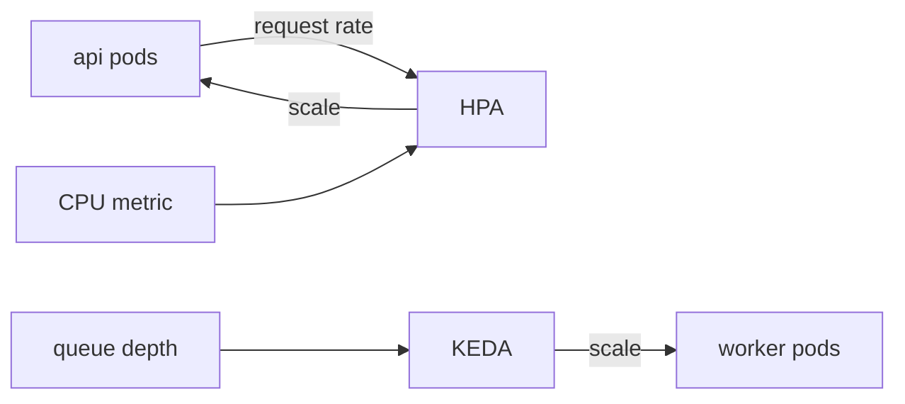

# Autoscaling

## Context

- Ingest is 2k events/s sustained with 10k/s hourly bursts; a burst
  that outlives scale-up becomes dashboard-visible lag in ~60 s.
- The DB is the platform's hard ceiling: PG `max_connections` = 500,
  and write IOPS saturates before CPU does under projection load.
- One team pages — scale events must be self-limiting, never a 3 a.m.
  decision.

## Goal

Keep ingestion and API latency inside SLO during bursts without paying
for peak capacity all day — and never scale past the DB's ceiling into
a pile-up.

## Design

- **api** — HPA on CPU (target 65%) *and* ingress request rate; scale-up
  is aggressive (double every 30 s if needed), scale-down waits 5 min.
- **worker** — KEDA scaled-object on job-queue depth (target ≤ 500
  queued per pod); scale-to-zero is disabled — a cold worker adds ~20 s
  of ingest lag.
- **Ceilings** — api max 12 pods, worker max 20; beyond that the DB is
  the bottleneck anyway, so more pods only pile up connections.

## Failure modes

| Failure | What happens |
|---|---|
| Burst outlives worker ceiling | Queue depth climbs past the 10-min alert → page; ingest still accepts (queue absorbs), lag is visible on `eta.stale` |
| api at ceiling, DB conns near cap | HPA stops adding pods by design — the ceiling is the circuit breaker; 429s shed load per-tenant (rate-limit design doc) |
| KEDA scaler metric gap | Queue still drains at fixed replica count; alerting on depth-not-falling catches a dead scaler within 10 min |
| Postgres write IOPS saturated | Both ceilings already stop short of it; the first observable symptom is projection lag, not pod count |

## Decisions and alternatives

- **KEDA on queue depth** over a custom controller and over CPU-based
  worker scaling — queue depth is the *lead* indicator of ingest lag;
  worker CPU rises only after the backlog exists. A custom controller
  was rejected: KEDA's scaled-object primitive covers this exactly and
  the team's ops surface stays stock.
- **Dual trigger (CPU + request rate) for api** over CPU alone — request
  rate leads CPU by ~20 s at burst onset (TLS handshakes and auth cost
  before work); CPU-only scaling starts the scale-up already behind.
- **VPA rejected** — vertical resize can't absorb 5-minute bursts and
  pod restarts during ingest are a regression, not a fix.
- **Hard pod ceilings below the DB connection limit** — scaling past
  the DB doesn't degrade gracefully, it converts a latency event into
  a connection-exhaustion outage. The ceiling exists so autoscaling
  fails *safe*.

## Service impact

| Change to this mechanism | Services affected | Blast radius |
|---|---|---|
| HPA target/threshold | api | API latency during bursts |
| KEDA queue-depth target | worker | Event-processing lag, notification delay |
| Pod ceiling raise | api, worker | DB connection pressure — check PG max_connections first |
| Scale-down cooldown | api, worker | Cost vs flapping; too short thrashes pods |

`services:` in frontmatter names the same set — tools can walk it.

## Observability

- `hpa_scaling_events` and `keda_scaler_metrics` feed the
  `service-health` Grafana board.
- Alert: worker at max replicas *and* queue depth still climbing for
  10 min → page (ingest is falling behind).
- Alert: api pods at ceiling *and* P95 > SLO for 5 min → page (the
  circuit breaker is holding but the load is real).

## Scaling

- api ceiling is set by DB connections (12 pods × pool 20 < PG 500 cap).
- worker ceiling is set by queue throughput, not CPU — more pods stop
  helping once DB writes saturate.
- First thing to break at 3× sustained load: PG write IOPS, not pods.

## Known issues

- KEDA polls queue depth every 15 s — a sub-15 s burst still queues
  briefly.
- No autoscaling for Redis or PG — they're vertical; see the service
  map in [README.md](README.md).
