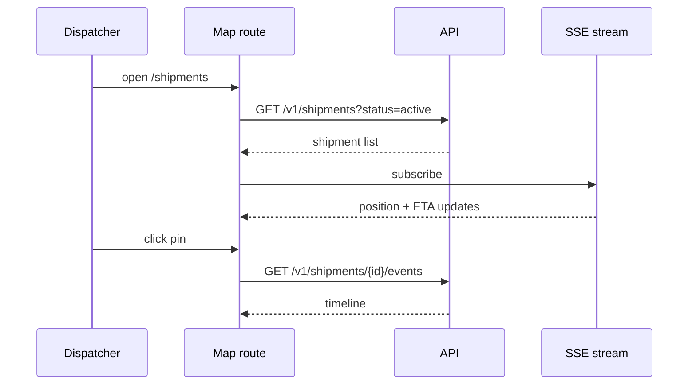

# Tracking map

Route: `/shipments` + `/shipments/:id` — permission: `viewer` and up

## Context

- Dispatchers keep this screen open 8+ hours; ~5k active shipments on a
  busy day.
- Depot machines are old and site Wi-Fi congested — long-lived
  connections drop and reconnect regularly.
- "Is this truck late?" is answered in seconds from pin color; a
  silently-stale map causes wrong dispatch calls, so freshness must be
  visible, not assumed.

## Goal

A dispatcher sees every active shipment on one map, spots delays without
reading rows, and drills into a single shipment's timeline in one click.

## Contract

- **Data in** — `GET /v1/shipments?status=active` for the map; SSE
  stream for live position updates; `GET /v1/shipments/{id}/events` for
  the detail timeline.
- **States** —
  - *loading*: map shell + skeleton pins
  - *empty*: "no active shipments" with filter reset hint
  - *error*: banner + last-known data, auto-retry with backoff
  - *ready*: pins clustered by depot; red ring = delayed
- **Actions** — filter by carrier/status; click a pin for the detail
  panel; detail panel shows the event timeline and ETA confidence.

## Interactions

## Degraded behavior

Freshness is shown, not assumed — this is a design choice driven by the
context above.

- SSE dropout > 10 s → a "live updates paused" chip appears and the map
  switches to 30 s polling. The chip clears on reconnect; there is no
  silent stale state.
- API 5xx on poll → last-known data stays rendered with a
  `data as of HH:MM` timestamp; three consecutive failures escalate to
  the error banner.
- `eta.stale: true` in a payload renders the ETA greyed with a tooltip —
  the API's honesty propagates to the UI.

## Decisions and alternatives

- **SSE** over polling and WebSockets — position updates are
  unidirectional and continuous. Polling every 30 s was rejected:
  dispatch decisions happen inside that window, and 5k clients polling
  would multiply read load for worse freshness. WebSockets were
  rejected: bidirectional capability is unused here, and
  sticky-connection handling through the ingress LB adds ops cost for
  zero benefit. SSE gives HTTP semantics, auto-reconnect, and
  `Last-Event-ID` resume for free.
- **Server-driven `stale` flag** over client-side age guessing — the
  worker knows the projection lag; a client timer would disagree with
  reality exactly when it matters (queue backlog).
- **Depot-based pin clustering** over grid clustering — dispatchers
  think in depots, not pixels; a cluster expanding to its depot's
  shipments matches how they verbalize locations.

## Security

A `viewer` sees the same data as a `dispatcher` — the role gates write
actions elsewhere, not visibility here. Session expiry redirects to SSO.
No consignee PII is ever rendered — pins and timelines show IDs only.

## Known issues

- Clusters above ~5k pins get slow on older depot hardware — no
  viewport-level tiling yet.
- SSE fallback depends on the browser's `EventSource` reconnect, which
  some proxy appliances defeat; the 30 s poll covers this but the
  "paused" chip can lag real disconnection by its 10 s threshold.
