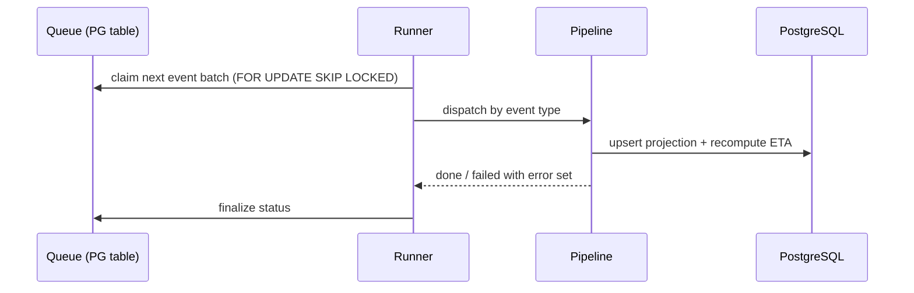

# Worker

## Context

- The API acks events once queued (see [api/](../api/)),
  so this service owns everything after the ack — and everything that can
  go wrong after it.
- 2k events/s sustained; a crashed worker's backlog must drain without
  human action.
- One small team operates the whole platform — a mechanism that pages at
  3 a.m. for self-healing problems is a design failure here.

## Goal

Consume queued tracking events and turn them into state — recompute
ETAs, raise delay alerts, dispatch notifications — so ingestion stays
decoupled from downstream latency.

## Boundaries

The API enqueues events; the worker owns processing entirely — claim,
compute, checkpoint, finalize. Nothing outside `worker/` writes event
state or projections.

## Design

- **Claiming** — `FOR UPDATE SKIP LOCKED`; a crashed worker's batch is
  reclaimed after its lease expires.
- **ETA loop** — each event recomputes the shipment ETA from carrier
  history and current position; alerts fire on threshold crossings.
- **Projection write** — the folded shipment state the API serves lives
  here; the API never recomputes.
- **Idempotency** — events carry a source-supplied ID; reprocessing is a
  no-op, so lease-expiry retries are safe.

## Failure modes

| Failure | Behavior |
|---|---|
| Worker crash mid-batch | Lease expiry returns the batch to the queue; reprocessing is a no-op via `event_id` |
| DB write contention at burst | Claim rate self-limits — batches slow, queue depth rises, KEDA adds pods (see [infra/autoscaling](../infra/autoscaling.md)) |
| Notification channel down | Channel-specific retries with backoff; event itself is finalized — a lost alert never blocks state |
| Poison event (always fails) | Fails the batch 3×, then parks in `dead` with the error set; never starves the queue |

## Dependencies

| Depends on | Why |
|---|---|
| `api` queue table | Claim and finalize event state |
| `infra/` | Pool sizing, queue depth alerts — see [infra/](../infra/) |

## Decisions and alternatives

- **Postgres-backed queue** over a dedicated broker (Kafka/SQS) — at 2k
  events/s with one ops team, a broker adds a failure domain and an ops
  skill set for throughput Postgres already covers; `SKIP LOCKED` gives
  competitive claiming with zero new infra. Revisit if ingestion
  crosses ~10× current sustained load — the projection writes, not the
  queue, will signal it first.
- **Batch checkpointing** over per-event transactions — the batch is the
  unit of failure, so retries never replay partial work; per-event
  commits would triple write amplification at burst rates.
- **Heuristic ETA (carrier-history + position)** over a learned model —
  with ~500k active shipments the data is thin for per-route models,
  and a heuristic's failure is debuggable by the on-call; a model's is
  not. Drift during carrier-wide delays is a known hole (below).
- **Finalize-then-notify** over notify-in-transaction — a slow
  notification channel must not hold the batch; the trade is
  at-least-once alerts, accepted below.

## Security

Worker DB role excludes credential tables; notification payloads never
contain shipment contents — they reference IDs the recipient can query.

## Known issues

- ETA model drifts during carrier-wide delays (weather, strikes); no
  fleet-level dampening yet.
- Notification retries are at-least-once — a channel timeout can emit a
  duplicate alert.

## Testing

`worker/` tests cover claim/finalize transitions, idempotent replay,
poison-event parking, and ETA threshold alerting.
