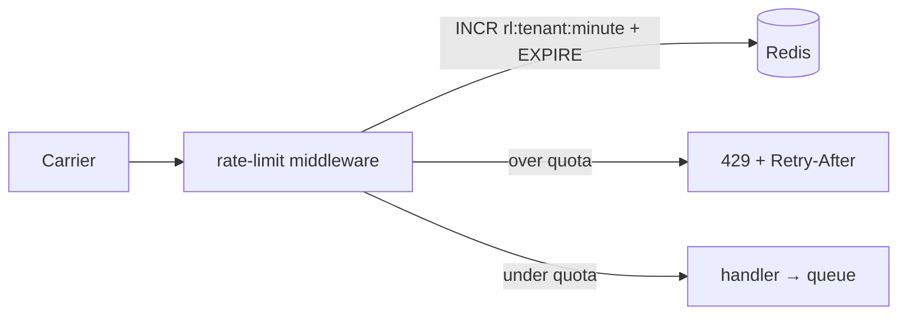

# Per-tenant API rate limits — Overview

Adds per-tenant rate limits to the ingestion surface so one partner's
burst can't degrade the shared SLO. Phase 1 lands enforcement; phase 2
makes the counter store HA and surfaces usage to operators.

- **Created**: 2026-09-15
- **Repositories**: `acme/freightloop`
- **Scope**: this doc is self-contained for review — the design and its
  trade-offs live here; the `phase-N-*.md` files track execution only.

## Context

**Resolves:** [issue 0001 — API has no backpressure](../../issues/0001-api-no-backpressure.md)

The events endpoint has no quota check; one carrier's retry loop
already caused a fleet-wide 4-minute ingest lag incident. The queue
absorbs bursts today but lag is shared across tenants.

### Operating assumptions

| Assumption | Value |
|---|---|
| Limit granularity | Per carrier key, per minute window |
| Default quota | 600 events/min per tenant (2× observed p99) |
| Counter store | Redis — see [ADR-0002](../../adr/0002-redis-rate-limit-state.md) |
| Redis outage behavior | Fail open (log + allow) — never block ingestion |

## Goals and non-goals

| Goal | Phase |
|---|---|
| Enforce per-tenant limits on ingestion | 1 |
| Operators can see and tune quotas | 2 |
| Counter store survives a Redis failover | 2 |

Non-goals: per-shipment or per-route limits; self-serve quota
management for carriers; edge DDoS protection (the CDN perimeter's
job).

## Options and trade-offs

| Option | Cost / trade-off | Verdict |
|---|---|---|
| Token bucket in middleware, counters in Redis | Redis joins the request path — bounded by fail-open | **Accepted** |
| Per-pod in-memory buckets | Limit becomes `quota × pod count` under HPA | Rejected ([ADR-0002](../../adr/0002-redis-rate-limit-state.md)) |
| Queue-level shedding | Drops already-accepted work; punishes well-behaved tenants sharing the queue | Rejected |

## Proposed architecture

Token-bucket middleware ahead of the shipments handler:



- Counter: `INCR rl:<tenant>:<minute>` + `EXPIRE`; over quota → `429`
  + `Retry-After` in the API's standard problem shape.
- Quotas per carrier key in `api/config/limits.yaml`; default 600
  events/min.
- **Fail-open**: Redis unreachable → log + allow. Limiting must never
  block ingestion.
- Phase 2 adds `GET /v1/usage` (current window + quota), a dashboard
  usage bar with a dispatcher-role quota editor, and a Redis
  primary/replica pair with sentinel failover.

Field-level contract detail lives in `api/openapi.yaml` — not
duplicated here.

## Cross-cutting concerns

- **Observability** — `rate_limit_exceeded_total` per tenant; Redis
  call latency is measured on the request path.
- **Fault tolerance** — fail-open bounds the new Redis dependency;
  phase 2 removes the single-node failure mode.
- **Security** — counter keys are carrier IDs, not PII; quota config
  is ops-owned, not carrier-editable.

## Rollout and migration

| Phase | Title | Priority | Status | Pull request |
|---|---|---|---|---|
| 1 | [Token-bucket middleware](phase-1-token-bucket.md) | P0 | Merged | #81 |
| 2 | [Usage meter + Redis HA](phase-2-usage-and-redis-ha.md) | P1 | In progress | #96 |

Status legend: Not started · In progress · In review · Merged ·
Deferred · Dropped

```text
Phase 1 ──> Phase 2
(enforcement first; dashboard + HA build on the same counters)
```

- Phase 1 ships enforcement only — operators can't see or tune limits
  until phase 2.
- **Rollback**: disable the middleware flag → requests pass through
  unchanged. Fail-open means a Redis outage never requires a rollback.

## Success metrics

- No repeat of the 2026-09-08 failure class: one carrier's retry loop
  can no longer push ingest lag past the 30 s SLO.
- 429 responses observable per tenant (`rate_limit_exceeded_total`);
  ops can answer "why was I throttled" without a deploy.
- Rate-limit check adds < 2 ms p99 to the ingestion path.

## Open questions

- [ ] What limit applies to `GET /v1/usage` itself — unbounded reads
  are the same bug class this doc fixes.
- [ ] Default quota for sandbox/trial carrier keys.
