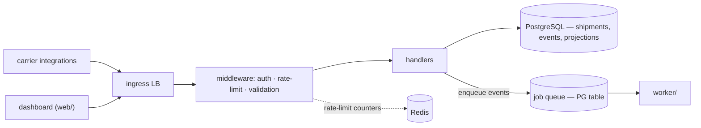

# Freightloop API design

## Overview

One REST surface for two audiences: carrier integrations pushing
tracking events, and the ops dashboard reading shipment state. Every
external interaction with Freightloop goes through here.

## Background and motivation

- ~40 carrier integrations push events; their SDKs range from modern
  HTTP clients to scheduled FTP-to-HTTP bridges that can POST but can't
  poll or hold connections open.
- Sustained ingestion is ~2k events/s with 10k/s hourly bursts (depot
  scan batches land on the hour).
- Carriers retry non-2xx aggressively — duplicate delivery is normal.
- The dashboard reads continuously; reads and writes share one SLO
  window.

## Goals and non-goals

### Goals

- One authenticated surface for event ingestion and shipment reads.
- Idempotent writes — carrier retries must never double-record.
- Contract stability a POST-only bridge can honor for years.

### Non-goals

- No bulk import surface — registration is per-shipment, by design.
- No ad-hoc query language or GraphQL — filters stay enumerable.
- No outbound push to carriers — polling/SSE is the caller's side.

## System architecture

The API is thin by design: authenticate, validate, dedupe, persist or
enqueue, ack. Everything computable later (ETA, alerts, notifications)
is deferred to the worker so ingestion latency stays flat.

## Conventions

Each convention is a decision; the rejected alternative is what keeps
it from being arbitrary.

- **Auth** — partner keys scoped per carrier (`events:write`,
  `shipments:read`); dashboard calls carry the user's SSO session.
  Scoped keys over OAuth bearer flows because several carrier bridges
  can't run a token-refresh dance.
- **Versioning** — path prefix (`/v1/`); breaking changes ship a new
  prefix, never a flag. URL pinning is the only mechanism every
  integration — including FTP-bridge schedulers — actually honors.
- **Errors** — RFC 9457 problem shape (`type`, `title`, `status`,
  `detail`, `code`). Chosen over ad-hoc `{error: "msg"}` because
  partner SDKs key retries off a stable `code`.
- **Pagination** — cursor-based on every list endpoint; `next_cursor`
  is null at the end. Offset was rejected: event tables are
  append-heavy, so offsets drift under concurrent writes.
- **Idempotency** — writes dedupe on a client-supplied key. Carriers
  retry non-2xx aggressively, so idempotent writes are the surface's
  correctness guarantee, not a nicety.

## In this directory

| Doc | Contract surface |
|---|---|
| [shipments.md](shipments.md) | Shipment lifecycle + tracking event ingestion |

One doc per contract surface — a resource's CRUD family or one endpoint
group. Schemas live in `api/openapi.yaml`; these docs carry the
invariants and decisions a caller relies on.

## Dependencies

| Depends on | Why |
|---|---|
| PostgreSQL | shipments, events, folded projections, queue table |
| Job queue (PG table) | durable event handoff to the worker — see [worker/design/](../../worker/design/) |
| Redis | rate-limit counters ([ADR-0002](../../adr/0002-redis-rate-limit-state.md)) — fails open |

## Risks and mitigations

- A partner bursts beyond fair share → per-tenant token buckets landing
  in [the rate-limit plan](../../plan/api-rate-limits/); until it
  finishes, tracked as [issue 0001](../../issues/0001-api-no-backpressure.md).
- Redis on the request path → fail-open on outage; HA pair in the
  plan's phase 2.

## Testing

`api/` tests cover the contract surface — auth scoping, idempotent
writes, pagination cursors, and the ingestion ack semantics in
[shipments.md](shipments.md).
