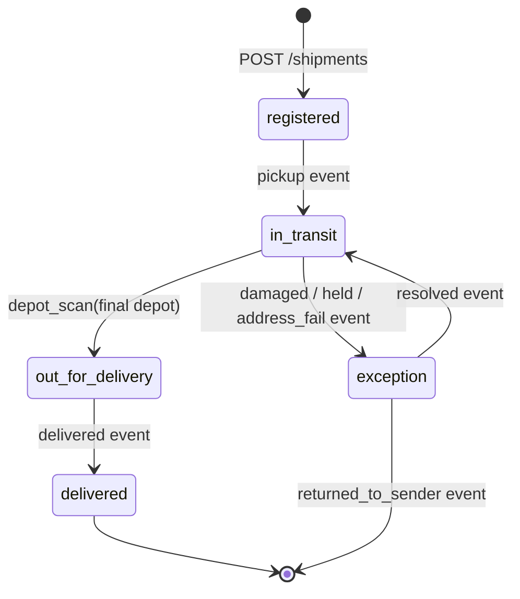

# Shipments API

## Context

- ~40 carrier integrations push tracking events; their SDKs range from
  modern HTTP clients to scheduled FTP-to-HTTP bridges that can POST
  but can't poll or hold connections open.
- Sustained volume is ~2k events/s with 10k/s bursts (depot scan
  batches land on the hour).
- The dashboard reads shipment state continuously; ops alert on lag,
  so reads and writes share the same SLO window.
- Carriers retry aggressively on any non-2xx — a `500` is replayed
  verbatim minutes later. Duplicate delivery is normal, not an edge
  case.

## Goal

Carriers register shipments and push tracking events; the dashboard and
integrations read shipment state and timelines. This surface is the only
write path for tracking data.

## Contract

| Endpoint | Verb | Effect |
|---|---|---|
| `/v1/shipments` | POST | Register a shipment; returns its ID |
| `/v1/shipments` | GET | List shipments (cursor-paginated, filtered) |
| `/v1/shipments/{id}` | GET | Shipment detail incl. current ETA |
| `/v1/shipments/{id}/events` | POST | Ingest tracking events (batch) |
| `/v1/shipments/{id}/events` | GET | Event timeline (cursor-paginated) |

- Events are scoped to the shipment in the path — a carrier key can only
  write to its own shipments.
- `POST /events` returns `202` once the batch is durably queued; event
  *processing* is asynchronous — see [worker/design/](../../worker/design/).

## Lifecycle

- A shipment reaches `delivered` only via a `delivered` event — no
  direct status writes. `exception` is re-entrant; a resolved shipment
  resumes `in_transit`, not its prior sub-state.
- Events may arrive out of order; `delivered` is terminal and cannot be
  reverted by a late `depot_scan`.

## Design

Events are append-only: a shipment's state is a fold over its event
stream, never a mutable status column. `POST /events` validates,
dedupes by client `event_id`, enqueues, and acks — the worker
recomputes state and ETA asynchronously. The GET endpoints read the
folded projection, so ingestion latency never couples to read latency.

## Failure modes

| Dependency fails | Caller sees |
|---|---|
| Queue enqueue error | `503` + `Retry-After`; nothing partially applied — retry the whole batch |
| Worker lag (events queued, unprocessed) | Reads still serve; `eta` field reports `stale: true` once projection lag > 60 s |
| Postgres read replica lag | Timeline may miss the newest seconds of events; `etag` on detail moves only when state actually changed |

A carrier retrying a `503` batch is safe end to end: `event_id`
dedupes at write, and redelivery at the worker is a no-op.

## Decisions and alternatives

- **Append-only event stream** over a mutable `status` column — carrier
  scans arrive out of order and get audited; a mutable status can't
  answer "what did we believe at time T" and rewrites history on late
  events. The cost (fold on write → projection) is absorbed by the
  worker, keeping reads simple.
- **Sync-ack-then-queue** over fire-and-forget ingest and over async
  webhook acks — carrier bridges can POST but can't receive callbacks,
  and unacked ingest makes the 4-minute-lag incident class
  undetectable at the source. The ack means "durably queued", not
  "processed", which is why the `eta.stale` flag exists.
- **Client-supplied `event_id`** over a server-side dedup window — a
  dedup window can't distinguish "carrier resent the same scan" from
  "two scans that look identical"; the carrier is the only party that
  knows. Carriers that can't generate IDs get `event_id = hash(payload)`
  computed server-side, which degrades to the same guarantee for
  exact-duplicate retries.
- **Cursor pagination** over offset — the events table is append-heavy;
  offset scans drift under concurrent writes and get expensive past
  ~100k rows, which large tenants hit quickly.
- **Rate limiting via token bucket in middleware** over queue-level
  shedding — shedding punishes well-behaved tenants sharing the queue;
  see [ADR-0002](../../adr/0002-redis-rate-limit-state.md) and
  [the rate-limit plan](../../plan/api-rate-limits/).

## Errors

| Status | When |
|---|---|
| 401/403 | Missing key, or key not scoped to the shipment's carrier |
| 409 | Duplicate `event_id` (safe to ignore on retry) |
| 422 | Malformed event payload |
| 429 | Tenant over rate limit — see [the rate-limit plan](../../plan/api-rate-limits/) |
| 503 | Queue unavailable — retry whole batch after `Retry-After` |

## Security

Carrier keys never see another carrier's shipments; dashboard reads are
role-scoped. Event payloads carry IDs, not PII — consignee identity
stays in the upstream orders system.

## Known issues

- No backpressure beyond per-tenant limits until the rate-limit plan
  finishes; a partner can still burst within quota — tracked as
  [issue 0001](../../issues/0001-api-no-backpressure.md).
