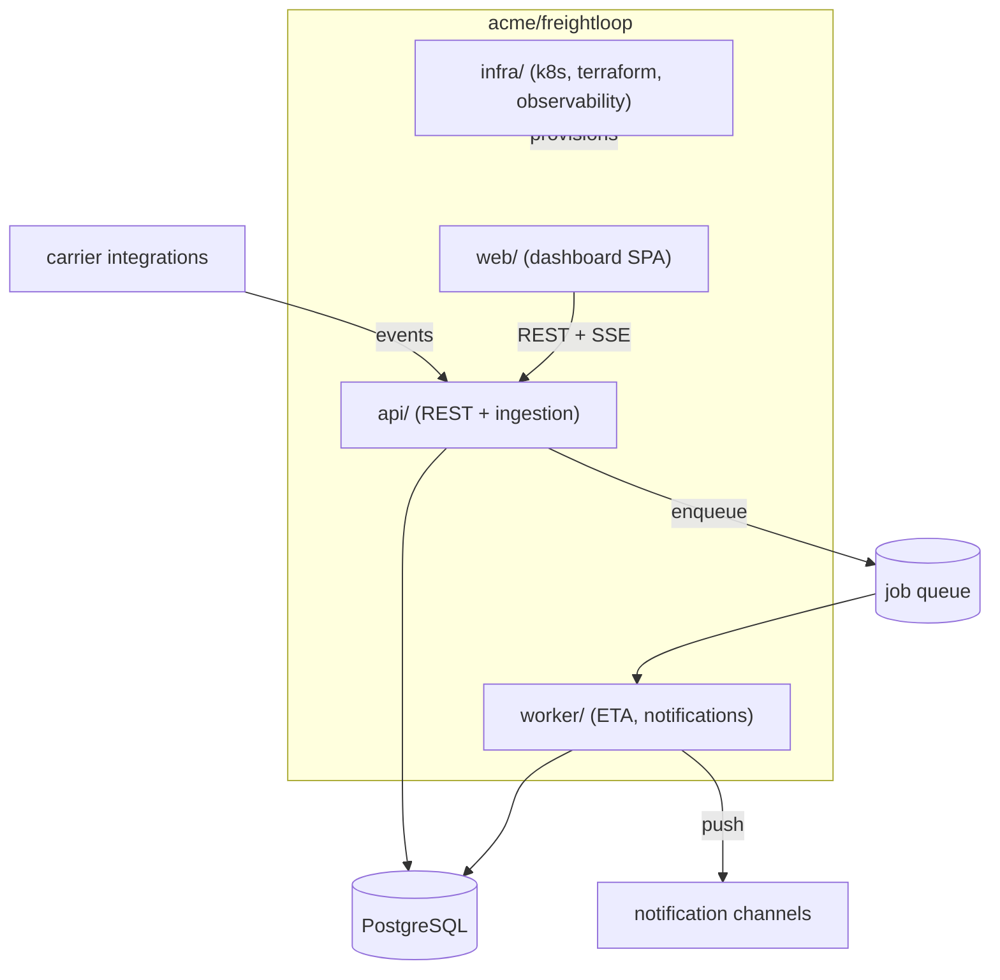

# Freightloop

Freightloop is a shipment-tracking platform for regional carriers: a REST
API that ingests tracking events, a web dashboard for dispatch ops, and a
worker fleet that computes ETAs and sends notifications. It exists so
shippers see one tracking feed instead of per-carrier portals.
*(Fictional example project.)*

## Goal

- One event stream per shipment — carrier pushes, depot scans, GPS pings.
- Ops dashboard answers "where is it and when does it land" in seconds.
- Partner integrations go through the API, never the database.

## Non-Goal

- Not a TMS — no order management, invoicing, or carrier billing.
- No customer-facing tracking pages — the dashboard serves carrier ops.
- No multi-region deployment — single region, single cluster.

## Requirements

**Functional**

- Ingest tracking events via API; compute per-shipment ETA continuously.
- Dashboard shows live map, per-shipment timeline, and delay alerts.
- Every event is attributable to a source (carrier key, depot scan, GPS).

**Non-functional**

- Sustained ingestion of 2k events/s; 10k/s bursts for up to 5 minutes.
- P95 dashboard read latency under 300 ms at ~500k active shipments.
- Event processing lag under 30 s at sustained load.

## Background

Carrier ops teams watched five carrier portals plus a spreadsheet of
phone numbers — events were late, inconsistent, and unaudited. The
platform centralizes the tracking feed while staying operable by one
team.

## Repositories

| Repository | Scope |
|---|---|
| `acme/freightloop` | api, web, worker, infra — one monorepo (this repo) |

## High-level architecture



## Components

| Component | Responsibility | Doc |
|---|---|---|
| api | REST surface, event ingestion, auth, audit | [api/design/](../api/design/) |
| web | Operator dashboard — map, timeline, alerts | [web/design/](../web/design/) |
| worker | ETA computation, notification dispatch | [worker/design/](../worker/design/) |
| infra | Cluster topology, scaling, observability | [infra/design/](../infra/design/) |

## Component internals

Per-module docs sit in each module's `design/` subtree — see the
Components table. Active change plans live under [../plan/](../plan/).

## Security

- Partner API keys are scoped per carrier; the dashboard uses SSO-backed
  sessions with role-gated routes.
- Event payloads carry shipment references only — PII stays in the
  orders system upstream.

## Decisions and alternatives

The system-level choices that shaped everything below; per-module
decisions live in each module's `design/` subtree.

- **One monorepo, four modules** over per-service repos — one team
  reviews and deploys all of it; repo boundaries would add versioning
  ceremony without isolating anything the team doesn't already own.
- **Postgres-backed job queue** over Kafka — sustained 2k events/s is
  far inside what a PG table plus `SKIP LOCKED` handles, and a broker
  would be the least-operable component in the stack for this team.
  The worker doc records when to revisit.
- **REST + SSE** over gRPC/WebSockets for external callers — carrier
  integrations include POST-only legacy bridges; gRPC's client
  requirements and WebSocket's bidirectional ops cost buy nothing here.
- **Event-sourced shipment state** over a mutable status column —
  carrier events arrive out of order and are audited; see
  [api/design/detailed.md](../api/design/detailed.md) for the surface
  this produces.
- **Single region** over multi-region — the carriers and their depots
  are regional; cross-region complexity can't pay for itself at this
  scope. Recorded here because revisiting it changes everything below.

## Risks and known issues

- Partner integrations can burst unbounded event traffic — no
  backpressure yet; tracked as [issue 0001](../issues/0001-api-no-backpressure.md).
- ETA model drifts during carrier-wide delays (weather, strikes).

## Testing

```bash
make verify            # lint + unit + integration for all modules
make verify-api        # api suite incl. ingestion contract cases
```

## Operations

Deployed from `infra/` manifests in this repo; staging previews per PR.
Dashboards cover ingestion lag, API latency, and queue depth — see
[infra/design/](../infra/design/) for the observability model.

## References

- Rate limiting plan: [../plan/api-rate-limits/](../plan/api-rate-limits/)

## In this directory

| Doc | Contents |
|---|---|
| — | This README is the only doc here — module docs live in each `<module>/design/` subtree |

## Notes

Docs here use OKF v0.2 frontmatter; each doc's `sources:` list declares
the files it is derived from and is updated in the same commit as code
changes.
