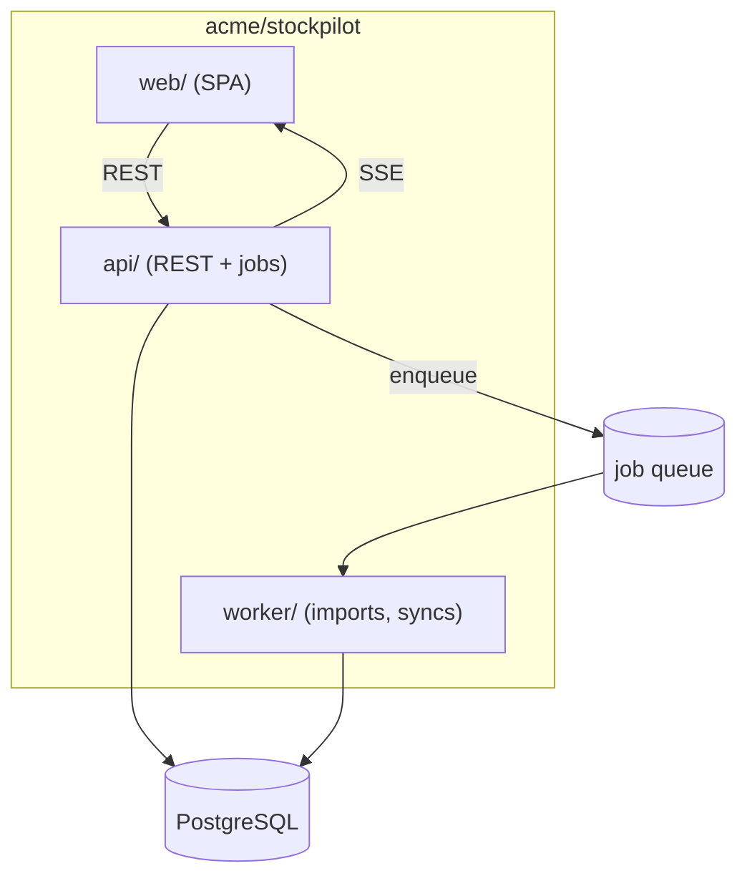

# Stockpilot

Stockpilot is an inventory platform for small warehouses: a web app for
catalog and stock operations, an API for integrations, and a worker fleet
for imports, syncs, and reports. It exists so operators track stock in one
place instead of spreadsheets. *(Fictional example project.)*

## Goal

- One source of truth for catalog, stock levels, and movements.
- Bulk operations (CSV import, supplier sync) run as background jobs.
- External integrations go through the API, never the database.

## Non-Goal

- Not an ERP — no accounting, purchasing, or payroll.
- No real-time collaborative editing of records.
- No multi-region deployment — single region, single database.

## Requirements

**Functional**

- CRUD for products, locations, and stock movements; full audit trail.
- CSV bulk import as an async job with per-row error reporting.
- Web dashboard for operators; REST API for integrations.

**Non-functional**

- P95 API read latency under 200 ms at catalog scale (~100k SKUs).
- Imports never block the dashboard; failed rows are retryable.
- Every mutation is attributed to a user or a job.

## Background

Warehouse ops ran on spreadsheets shared by email — drift, no audit
trail, no integrations. The platform centralizes stock truth while staying
small enough for one team to run.

## Repositories

| Repository | Scope |
|---|---|
| `acme/stockpilot` | API, worker, web app (this monorepo) |
| `acme/stockpilot-infra` | Terraform, deploy manifests |

## High-level architecture



## Components

| Component | Responsibility | Doc |
|---|---|---|
| api | REST surface, auth, job enqueue, audit writes | — |
| worker | Executes imports, supplier syncs, reports | [worker.md](worker.md) |
| web | Operator dashboard; API client only | — |

## Component internals

Job lifecycle and import row pipeline live in [worker.md](worker.md);
active change plans live under [../plan/](../plan/).

## Security

- API tokens are scoped per integration; the dashboard uses SSO-backed
  sessions.
- Workers run with a DB role that cannot read credentials tables.

## Risks and known issues

- Imports of >100k rows hold a worker for minutes — no sharding yet.
- Supplier sync is pull-once-daily; a missed window waits a full day.

## Testing

```bash
make verify            # lint + unit + integration for all modules
make verify-worker     # worker suite incl. import pipeline cases
```

## Operations

Deployed from `acme/stockpilot-infra` manifests; staging previews per PR.
Dashboards cover job queue depth, import failure rate, and API latency.

## References

- CSV import plan: [../plan/bulk-import/](../plan/bulk-import/)

## In this directory

| Doc | Contents |
|---|---|
| [worker.md](worker.md) | Job lifecycle, import pipeline, isolation rules |

## Notes

Docs here use OKF v0.2 frontmatter; each doc's `sources:` list declares
the files it is derived from and is updated in the same commit as code
changes.
