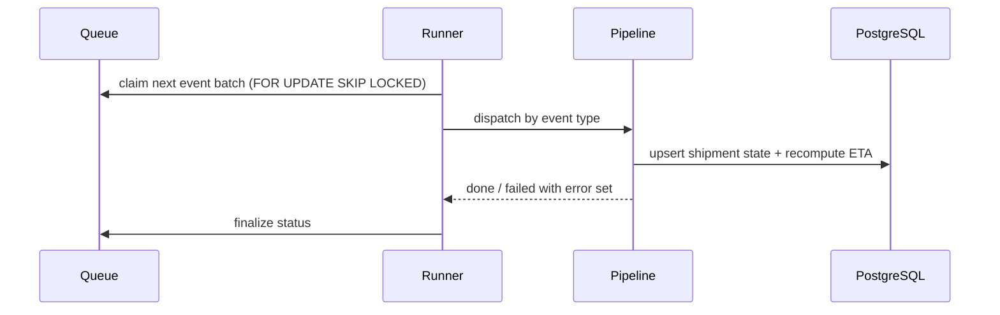

# Worker

## Goal

Consume queued tracking events and turn them into state — recompute
ETAs, raise delay alerts, dispatch notifications — so ingestion stays
decoupled from downstream latency.

## Boundaries

The API enqueues events; the worker owns processing entirely — claim,
compute, checkpoint, finalize. Nothing outside `worker/` writes event
state.

## Design

- **Claiming** — `FOR UPDATE SKIP LOCKED`; a crashed worker's batch is
  reclaimed after its lease expires.
- **ETA loop** — each event recomputes the shipment ETA from carrier
  history and current position; alerts fire on threshold crossings.
- **Idempotency** — events carry a source-supplied ID; reprocessing is a
  no-op, so lease-expiry retries are safe.

## Dependencies

| Depends on | Why |
|---|---|
| `api` queue table | Claim and finalize event state |
| `infra` module | Pool sizing, queue depth alerts — see [infra/design/](../infra/design/) |

## Key decisions

- Batch checkpointing over per-event transactions — the batch is the
  unit of failure, so retries never replay partial work.

## Security

Worker DB role excludes credential tables; notification payloads never
contain shipment contents — they reference IDs the recipient can query.

## Known issues

- ETA model drifts during carrier-wide delays; no fleet-level dampening
  yet.
- Notification retries are at-least-once — a channel timeout can emit a
  duplicate alert.

## Testing

`worker/` tests cover claim/finalize transitions, idempotent replay, and
ETA threshold alerting.
