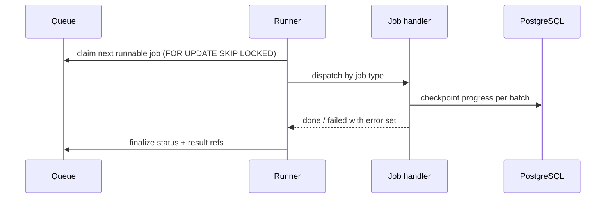

# Worker

## Goal

Execute background jobs — bulk imports, supplier syncs, scheduled reports
— so user-facing API latency is never coupled to batch work.

## Boundaries

Other modules enqueue jobs via the queue table; the worker owns job
execution entirely — claim, run, checkpoint, finalize. Nothing outside
`worker/` may write job state.

## Design

- **Claiming** — `FOR UPDATE SKIP LOCKED`; a crashed worker's job is
  reclaimed after its lease expires.
- **Import pipeline** — parse → validate → stage → apply, checkpointed
  per batch so a mid-import crash resumes, not restarts.
- **Isolation** — each job runs in one transaction scope per batch; a bad
  row marks the row, not the job.

## Dependencies

| Depends on | Why |
|---|---|
| `api` job table | Claim and finalize job state |
| `acme/stockpilot-infra` | Worker pool sizing and env config |

## Key decisions

- Batch checkpointing over row-level transactions — see the
  [bulk-import plan](../plan/bulk-import/README.md).

## Security

Worker DB role excludes credential tables; job payloads never contain
secrets — they reference upload objects by ID.

## Known issues

- A single huge import occupies a worker for minutes — no fair
  scheduling between job types yet.
- Lease expiry uses wall-clock; a paused (not crashed) worker can lose
  its job mid-batch and the job retries — handlers must be idempotent.

## Testing

`worker/` tests cover claim/finalize transitions, per-batch checkpoint
resume, and per-row error attribution.
