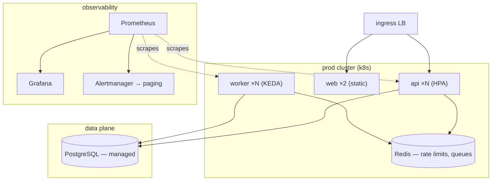

# Infrastructure

## Goal

One production cluster running api, web, and worker; per-PR staging
previews; and an observability stack that answers "what broke, and who
feels it" before the page.

## Topology

## Service map

Which infra components serve which services — the first place to look
when an infra change lands.

| Service | Runs on | Scales by | Infra docs |
|---|---|---|---|
| api | k8s deployment | CPU + request rate (HPA) | [autoscaling.md](autoscaling.md) |
| worker | k8s deployment | Queue depth (KEDA) | [autoscaling.md](autoscaling.md) |
| web | CDN + static pods | Fixed ×2 | — |
| Redis | in-cluster StatefulSet | Vertical; HA pair planned | [autoscaling.md](autoscaling.md) |
| PostgreSQL | managed instance | Vertical only | — |

## Observability

- **Metrics** — Prometheus scrapes every service; Grafana boards:
  `service-health`, `ingestion-lag`, `queue-depth`.
- **Logs** — structured JSON to the cluster aggregator; 30-day
  retention, shipped to cold storage.
- **Traces** — OTel on the api ingest path only (event → enqueue);
  worker spans sampled at 10%.
- **Alerts** — Alertmanager routes by service label; page only on
  user-visible symptoms (API 5xx rate, ingest lag > 60 s).

## Scaling model

- `api` scales on CPU *and* request rate; `worker` on queue depth —
  see [autoscaling.md](autoscaling.md) for triggers and ceilings.
- PostgreSQL is vertical-only; a managed read replica is the planned
  relief valve, not yet scheduled.
- Redis is single-node today — the [rate-limit plan](../../plan/api-rate-limits/)
  adds it to the hot path and plans an HA pair.

## In this directory

| Doc | Mechanism | Services affected |
|---|---|---|
| [autoscaling.md](autoscaling.md) | HPA + KEDA scaling triggers, ceilings | api, worker |
