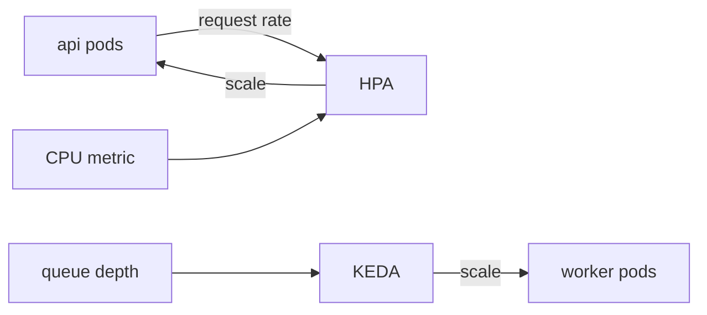

# Autoscaling

## Goal

Keep ingestion and API latency inside SLO during bursts without paying
for peak capacity all day.

## Design

- **api** — HPA on CPU (target 65%) *and* ingress request rate; scale-up
  is aggressive (double every 30 s if needed), scale-down waits 5 min.
- **worker** — KEDA scaled-object on job-queue depth (target ≤ 500
  queued per pod); scale-to-zero is disabled — a cold worker adds ~20 s
  of ingest lag.
- **Ceilings** — api max 12 pods, worker max 20; beyond that the DB is
  the bottleneck anyway, so more pods only pile up connections.

## Service impact

| Change to this mechanism | Services affected | Blast radius |
|---|---|---|
| HPA target/threshold | api | API latency during bursts |
| KEDA queue-depth target | worker | Event-processing lag, notification delay |
| Pod ceiling raise | api, worker | DB connection pressure — check PG max_connections first |
| Scale-down cooldown | api, worker | Cost vs flapping; too short thrashes pods |

`services:` in frontmatter names the same set — tools can walk it.

## Observability

- `hpa_scaling_events` and `keda_scaler_metrics` feed the
  `service-health` Grafana board.
- Alert: worker at max replicas *and* queue depth still climbing for
  10 min → page (ingest is falling behind).

## Scaling

- api ceiling is set by DB connections (12 pods × pool 20 < PG 500 cap).
- worker ceiling is set by queue throughput, not CPU — more pods stop
  helping once DB writes saturate.
- First thing to break at 3× sustained load: PG write IOPS, not pods.

## Known issues

- KEDA polls queue depth every 15 s — a sub-15 s burst still queues
  briefly.
- No autoscaling for Redis or PG — they're vertical; see the service
  map in [README.md](README.md).
