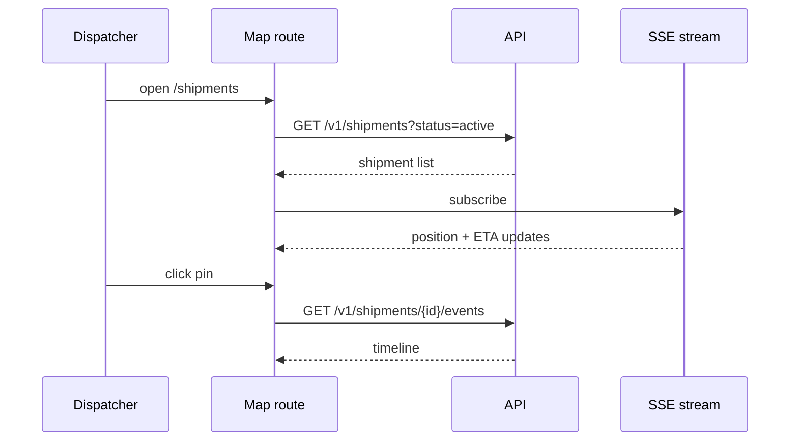

# Tracking map

Route: `/shipments` + `/shipments/:id` — permission: `viewer` and up

## Goal

A dispatcher sees every active shipment on one map, spots delays without
reading rows, and drills into a single shipment's timeline in one click.

## Contract

- **Data in** — `GET /v1/shipments?status=active` for the map; SSE
  stream for live position updates; `GET /v1/shipments/{id}/events` for
  the detail timeline.
- **States** —
  - *loading*: map shell + skeleton pins
  - *empty*: "no active shipments" with filter reset hint
  - *error*: banner + last-known data, auto-retry with backoff
  - *ready*: pins clustered by depot; red ring = delayed
- **Actions** — filter by carrier/status; click a pin for the detail
  panel; detail panel shows the event timeline and ETA confidence.

## Interactions

## Key decisions

- SSE over polling — the map updates continuously; see the API
  conventions in [api/design/](../../api/design/).

## Security

A `viewer` sees the same data as a `dispatcher` — the role gates write
actions elsewhere, not visibility here. Session expiry redirects to SSO.

## Known issues

- Clusters above ~5k pins get slow on older depot hardware — no
  viewport-level tiling yet.
- SSE dropout falls back to 30 s polling silently; the degraded state
  isn't surfaced in the UI.
