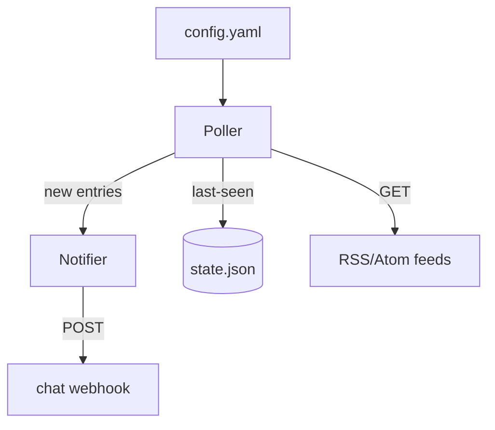

# Feedping

Feedping is a small CLI that polls RSS/Atom feeds on an interval and posts
new entries to a webhook — it exists so a team sees feed updates in chat
without running a hosted reader. *(Fictional example project.)*

## Goal

- Poll a configured set of feeds on an interval from one process.
- Post each new entry to a webhook, exactly once.
- Run unattended on a single machine — a single binary, local state.

## Non-Goal

- Not a multi-user service — one config file, one webhook.
- No scraping or feed formats beyond RSS/Atom.
- No retry queue or horizontal scaling — state fits in one file.

## Requirements

**Functional**

- Read a YAML config listing feeds and the webhook URL.
- Poll each feed every N minutes; post unseen entries to the webhook.
- Track the last-seen entry per feed so restarts don't re-post.

**Non-functional**

- Single static binary; state in one local file.
- A failed poll never blocks other feeds.
- Idle footprint in the tens of MB.

## Background

Hosted readers add accounts, polling lag, and another dashboard. The team
already lives in chat; a dumb poller plus a webhook covers the need with
nothing to operate.

## High-level architecture



## Components

| Component | Responsibility | Doc |
|---|---|---|
| Poller | Fetch feeds on a schedule, diff against last-seen, emit new entries | [poller.md](poller.md) |
| Store | Persist last-seen entry IDs durably | [store.md](store.md) |
| Notifier | POST entries to the webhook with light backoff | — |

## Component internals

Poll/diff loop and dedupe key choice live in [poller.md](poller.md);
the atomic-write scheme lives in [store.md](store.md).

## Security

- The webhook URL is a secret — read from env, never logged.
- The state file holds entry IDs and timestamps only.

## Risks and known issues

- A webhook outage drops entries after backoff is exhausted — no durable
  retry queue.
- A feed that rewrites IDs floods the channel once, then settles.

Actionable items are tracked in [../issues/](../issues/).

## Testing

```bash
go test ./...   # unit tests incl. poll/diff and atomic-write cases
```

## Operations

Runs as a cron job or a systemd timer; logs to stderr. `feedping -once`
is the manual/debug path.

## References

- RSS 2.0 / Atom RFC 4287

## In this directory

| Doc | Contents |
|---|---|
| [poller.md](poller.md) | Poll/diff loop, dedupe key, ordering guarantees |
| [store.md](store.md) | Last-seen persistence, atomic write scheme |

## Notes

Docs here use OKF v0.2 frontmatter; each doc's `sources:` list declares
the files it is derived from and is updated in the same commit as code
changes.
