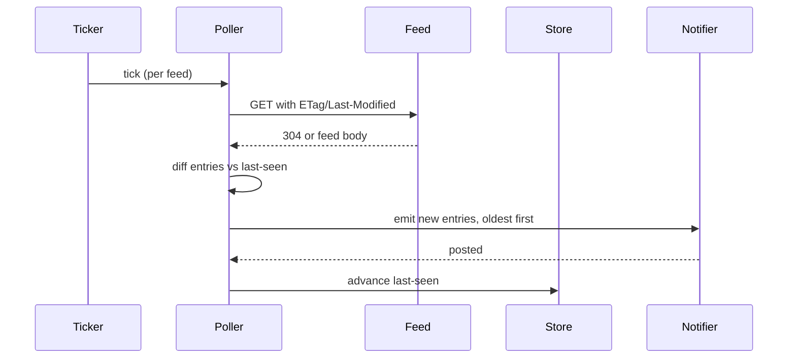

# Poller

## Goal

Fetch each configured feed on its interval, detect entries newer than the
last-seen marker, and hand them to the notifier — without ever blocking on
a slow or dead feed.

## Design

- **Dedupe key** — `guid` if present, else `link`, else a hash of
  `title+published`. The key, not the timestamp, decides "new".
- **Ordering** — new entries emit oldest-first so chat reads naturally.
- **Isolation** — each feed polls in its own goroutine with a per-request
  timeout; a hung feed can't starve the others.

## Key decisions

- File-based last-seen store instead of an embedded DB — see
  [ADR-0002](../adr/0002-json-state-store.md).

## Known issues

- Feeds that mint fresh `guid`s per entry (bad publishers) spam once,
  then settle — accepted, no special-casing.
- Conditional GET is skipped for feeds known to mishandle ETags.

## Testing

`internal/poller` tests cover the dedupe-key fallback order, oldest-first
emission, and timeout isolation between feeds.
